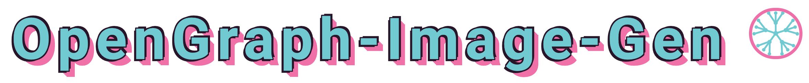

Dynamically generate OpenGraph social share images

Available at https://opengraph.cluster.fun/

## Example

```html

```


## Features

* Dynamically generate a PNG image for use as an OpenGraph share image
* Ideally sized for Twitter previews
* All text elements configurable
* Configurable colours
* All text fields optional

## Building from source

With Docker:

```sh
make docker-build
```

Standalone:

```sh
make build
```

## Contributing

If you find a bug or have an idea for a new feature please [raise an issue](issues/new) to discuss it.

Pull requests are welcomed but please try and follow similar code style as the rest of the project and ensure all tests and code checkers are passing.

Thank you 💛

## License

See [LICENSE](LICENSE)
